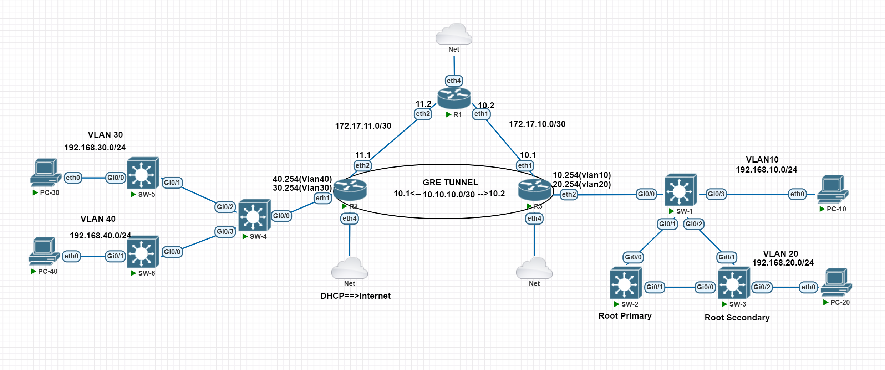

# 📘 GRE Tunnel Network Scenario

## 🧠 Scenario Overview

This scenario involves designing and implementing a wide area network using GRE Tunnel technology between two routers (R1 and R2), connecting different VLANs on both sides of the network. It also includes STP configuration for optimized path routing in switches and the use of DHCP Client and MikroTik firewall to provide internet access.


## 🥅Goals
1. Name all the equipment according to the image above.

2. Configure the specified IP addresses on the designated devices.

3. Define VLANs on all switches, and if necessary, configure Trunk.

4. Set up a GRE tunnel connection between routers R1 and R2, and ensure connectivity for all networks through the GRE tunnel.

5. On switch SW3, use STP to configure the default path for 20 VLANs to pass through SW1 to SW2 to SW3, with an alternate path through SW1 to SW3 in case of failure.

6. On router R2, enable internet access using the DHCP Client feature, and configure the MikroTik firewall to ensure that both ranges connected to router R2 have internet access. A successful PING test to 8.8.8.8 should verify the configuration.

---

## 📦 Requirements

To implement this scenario, you will need the following:

- MikroTik Routers with RouterOS installed
- Access to MikroTik Router GUI (Winbox or WebFig) for configuration
- Layer 2 or 3 Switches with VLAN and STP support
- PCs or end devices for VLAN segments
- Internet access for DHCP client test
- GRE Tunnel support on routers (enabled on RouterOS)
- Proper cabling or virtual links (if in a simulator like GNS3 or EVE-NG)

## ⚙️ Installation

Please follow the steps below to set up and use the project properly:

### 1. Download Network Topology Files

There are two versions of the network topology available:

🔹 If you only need the **network topology without configuration**:  
📦 [Download ZIP - No Configuration](https://github.com/MohammadAdelBalakhani/GREtunnel-STP-Routing-Nat-Scenario/blob/main/empty-scenario-template%20.zip)

🔹 If you want the **network topology with pre-configured settings**:  
📦 [Download ZIP - With Configuration](https://github.com/MohammadAdelBalakhani/GREtunnel-STP-Routing-Nat-Scenario/blob/main/complated-scenario.zip)

**Note:** Both files are in `.unl` format and can be used in simulators like EVE-NG.

**Note:** If you want, you can see the configurations of all the equipment without running [Click here](https://github.com/MohammadAdelBalakhani/GREtunnel-STP-Routing-Nat-Scenario/tree/main/Documents/Configs)

---

### 2. Import into Your Network Simulator

After extracting the downloaded ZIP file:
1. Open your network simulator (e.g., EVE-NG).
2. Use the **Import** option to load the `.unl` file.
3. Once imported, the topology will be ready to run.
4. Creating VLAN 10,20 on SW-1 & SW-2 & SW-3.

---

### 3. Download MikroTik Router Backup Files

To apply MikroTik configurations, backup files are provided in the `Documents` folder within this repository.

📁 [Download MikroTik Backups from the Documents folder](https://github.com/MohammadAdelBalakhani/GREtunnel-STP-Routing-Nat-Scenario/tree/main/Documents/Mikrotik-Router-BackUps)

Place and restore them according to the appropriate devices in your simulation.

---

### 4. Learn How to Use MikroTik Backup Files

If you're not familiar with how to restore MikroTik backup files, you can refer to the official MikroTik documentation:

📘 [How to Restore MikroTik Backup Files](https://operavps.com/docs/backup-restore-mikrotik/)

---

### 📬 Support

If you face any issues or have questions, feel free to reach out:

📧 adelbalakhani@gmail.com

---


## 📌 Topology Summary

### 🖥️ PCs:
- **PC-10**: Connected to VLAN10 (192.168.10.0/24)
- **PC-20**: Connected to VLAN20 (192.168.20.0/24)
- **PC-30**: Connected to VLAN30 (192.168.30.0/24)
- **PC-40**: Connected to VLAN40 (192.168.40.0/24)

### 🔀 Switches:
- **SW-1**: Connected to VLAN10 and network backbone
- **SW-2**: Root Primary for VLAN20
- **SW-3**: Root Secondary for VLAN20
- **SW-4**: Backbone switch (left side)
- **SW-5**: VLAN30 access
- **SW-6**: VLAN40 access

### 🌐 Routers:
- **R1**:
  - eth1: `172.17.10.2/30` → R3
  - eth2: `172.17.11.2/30` → R2
  
- **R2**:
  - eth1: `172.17.11.1/30` → R1
  - eth2: Connected to internal VLANs
  - eth4: DHCP Client → Internet
  - Tunnel Destination: `10.10.10.1`
- **R3**: Connects to right-side network and GRE tunnel
- eth1: `172.17.10.1/30` → R1

---

## ⚙️ Configuration Steps

### 1. **IP Addressing**
- Configure IPs according to the Complated topology for all router interfaces and PCs.

### 2. **VLAN Configuration**
- Define VLANs on switches:
  - VLAN 10,20 → SW-1
  - VLAN 10,20 → SW-2
  - VLAN 10,20 → SW-3
  - VLAN 30 → SW-5
  - VLAN 40 → SW-6
- Enable trunk ports between switches where necessary.

### 3. **GRE Tunnel Setup**
- Create a GRE tunnel between R1 and R2:
#### Router2:
  ```bash
  interface gre add name=gre-tunnel remote-address=10.10.10.2 local-address=10.10.10.1
ip address add address=10.10.10.1/30 interface=gre-tunnel
ip route add dst-address=0.0.0.0 gateway=172.17.11.2

```
  #### Router3:
   ```bash
  interface gre add name=gre-tunnel remote-address=10.10.10.1 local-address=10.10.10.2
  ip address add address=10.10.10.2/30 interface=gre-tunnel
  ip route add dst-address=0.0.0.0 gateway=172.17.10.2
  ```
- Test connectivity with `ping` from R2 to 10.10.10.2 and vice versa.

### 4. **Routing Configuration**
#### Router2:
- Set static routes to forward VLAN traffic through the GRE tunnel.
  ```bash
  ip route add dst-address=192.168.10.0/24 gateway=10.10.11.2
  ip route add dst-address=192.168.20.0/24 gateway=10.10.11.2

  ```
  #### Router3:
- Set static routes to forward VLAN traffic through the GRE tunnel.
  ```bash
  ip route add dst-address=192.168.30.0/24 gateway=10.10.10.2
  ip route add dst-address=192.168.40.0/24 gateway=10.10.10.2

  ```

### 5. **STP Setup (SW3)**
- On SW-2:
  ```bash
  spanning-tree vlan 20 priority 24576
  ```
- On SW-3:
  ```bash
  spanning-tree vlan 20 priority 28672
  ```

### 6. **Internet Access (R2)**
- Enable DHCP client on eth4:
  ```bash
  ip dhcp-client add interface=ether4 disabled=no
  ```
- Configure NAT for internet access:
  ```bash
  ip firewall nat add chain=srcnat action=masquerade
  ```

### 7. **Connectivity Test**
- Verify internet access with PING to 8.8.8.8 from PC-30 and PC-40.

---

## ✅ Final Checks

- [ ] GRE Tunnel Active
- [ ] All VLANs Reachable via Tunnel
- [ ] Proper STP Redundancy for VLAN 20
- [ ] Internet Access via DHCP on R2
- [ ] Successful PING to 8.8.8.8 from both sides
